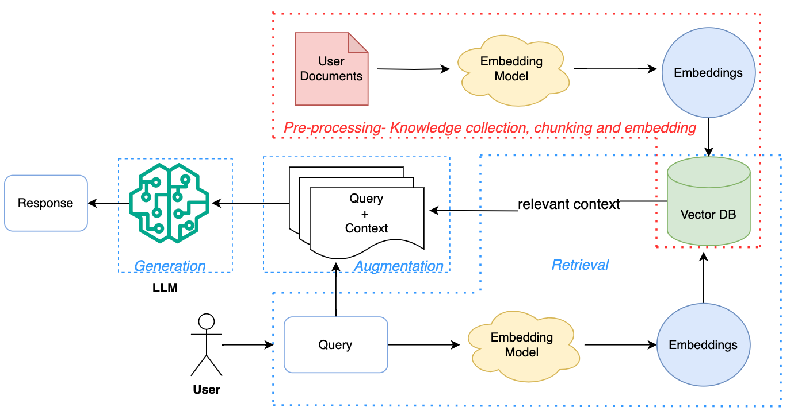

# ArabMedicalGPT

## Overview
ArabMedicalGPT is an Arabic advanced language model for medical applications, leveraging the powerful capabilities of GEMINI. This project aims to improve healthcare outcomes by providing more accurate and efficient medical language processing for diagnostics, treatment recommendations, and patient care.

## Features
- **Medical Language Understanding**: Enhanced comprehension of medical terminology.
- **Treatment Recommendation**: AI-driven suggestions for treatments based on patient history and current medical standards.
- **Question Answering**: Instant responses to medical queries, supporting both healthcare professionals and patients.

## Techstack Used:
- Python
- LangChain
- GEMINI
- Pinecone
- Django
- React

## RAG Architecture
In this project, I implemented the **Retrieval-Augmented Generation (RAG)** architecture, which enhances the model's ability to retrieve relevant documents and generate accurate, context-aware responses. This architecture is particularly useful in handling complex medical queries by providing precise information based on a vast knowledge base.

## UI Presentation
The user interface (UI) of ArabMedicalGPT was designed to provide a seamless experience for users. Below are screenshots of the key pages:

### Landing Page

### Chat Page

## Conclusion
ArabMedicalGPT represents a significant advancement in the application of AI and language models within the healthcare industry, particularly for Arabic-speaking regions. By leveraging state-of-the-art technologies such as the **Retrieval-Augmented Generation (RAG)** architecture, the model ensures accurate and context-aware responses that enhance both patient care and clinical decision-making.

The user-friendly interface, with its intuitive design on both the landing and chat pages, ensures that healthcare professionals and patients alike can easily access and utilize this powerful tool. As we continue to refine and expand the capabilities of ArabMedicalGPT, we anticipate it becoming an indispensable resource in improving healthcare outcomes and accessibility across diverse medical fields.

This project not only demonstrates the potential of AI in specialized applications but also sets the foundation for future innovations that could further revolutionize how medical information is processed and delivered.

